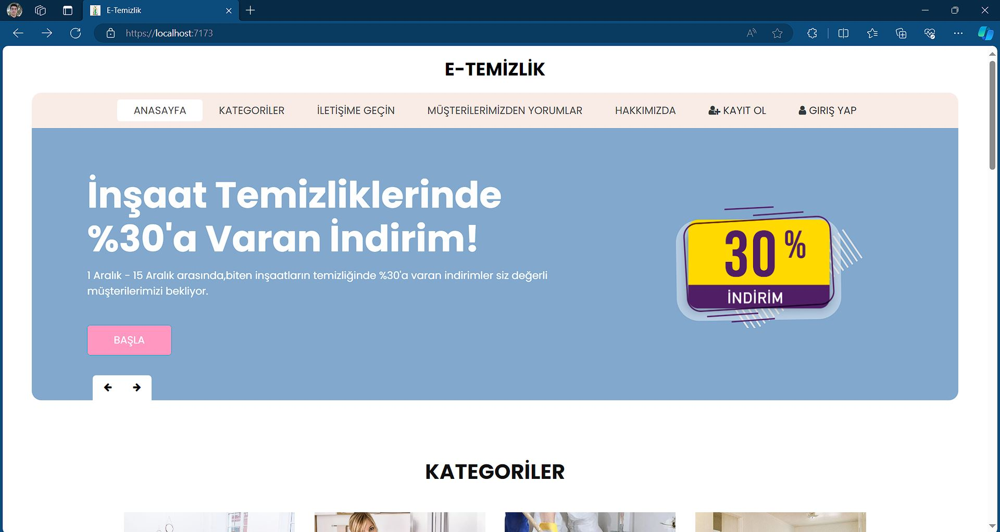
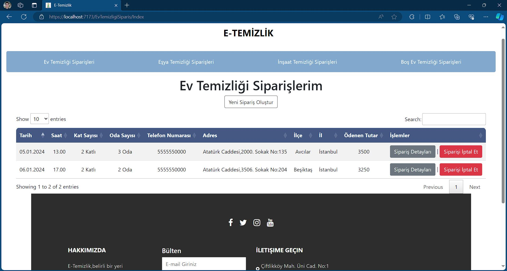
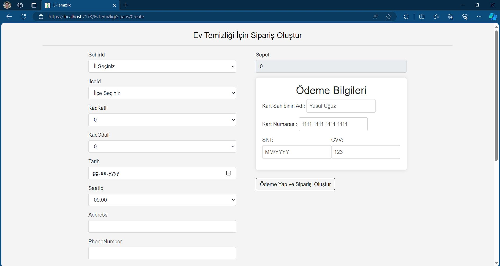

An E-Commerce Website (E-Cleaning)

Features: 
:heavy_check_mark: This website is a single page website with sections that appear as you scroll on the homepage. It consists of sections such as homepage, categories, about us, contact us, comments from our customers. 
 
:heavy_check_mark: When the user clicks on one of the categories, he/she is directed to the order creation screen for that category. 
 
:heavy_check_mark: There are login and registration functions using aspnet core identity. 
 
:heavy_check_mark: Orders created from the order creation screen can be viewed as tables in the "my orders" menu that appears after logging in. 
 

Technologies: 
:pushpin: ASPNET Core MVC  
:pushpin: ASPNET Core IDENTITY  
:pushpin: MSSQL  

Home Screen 
  
 
Login Screen 
 
Register Screen 
   
Orders Screen 
  
Create Order Screen 
 

This project developed by [YusufUguz](https://github.com/YusufUguz) 

